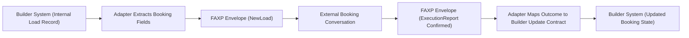

# Public Anonymized Adapter Package (Experimental)

This package is a public, vendor-neutral reference for builders implementing a FAXP adapter.

Maturity status:
- Experimental and early-stage.
- Intended for sandbox and evaluation use first.

## Purpose

This package gives contributors a safe, public artifact set they can use to:
1. understand adapter contract shape, and
2. test protocol handoff behavior without private partner data.

## Scope Boundary

FAXP role:
1. Standardize booking-plane messages.
2. Validate envelope and message conformance.
3. Keep interoperability contract consistent across builders.

Adapter role:
1. Translate builder-native records into FAXP messages.
2. Translate FAXP outcomes back into builder-native update calls.
3. Keep provider-specific auth, retries, and operational logic builder-side.

Out of scope for FAXP:
1. Dispatch execution.
2. Telematics/tracking lifecycle.
3. Settlement and payments.
4. Carrier compliance adjudication logic.

## Public-Safe Rules

All examples in this package are synthetic and anonymized:
1. No partner names.
2. No private domains.
3. No tokens or credentials.
4. No local filesystem paths.
5. No production identifiers.

## Package Contents

1. New-load envelope example:
   - `docs/builders/examples/public_adapter_contract/newload_envelope.sample.json`
2. Confirmed-booking execution report example:
   - `docs/builders/examples/public_adapter_contract/execution_report_envelope.sample.json`
3. Adapter-side builder update request example:
   - `docs/builders/examples/public_adapter_contract/adapter_update_request.sample.json`
4. Example notes:
   - `docs/builders/examples/public_adapter_contract/README.md`

## Handoff Model (Protocol vs Adapter)

## Practical Notes

1. A builder may create or edit its own load records before any FAXP message exists. That is builder-side setup, not a protocol action.
2. The FAXP handoff starts when the adapter emits a canonical FAXP message (`NewLoad`, `NewTruck`, etc.).
3. The protocol handoff ends when the adapter receives a terminal booking-plane message (typically `ExecutionReport`) and maps it back to builder-native update logic.

## Validation Baseline

Use the repo venv interpreter:

1. `.venv/bin/python tests/run_open_source_guardrails.py`
2. `.venv/bin/python tests/run_release_readiness.py`
3. `.venv/bin/python tests/run_conformance_suite.py`

