# Diagram: FAXP Scope Boundary

This diagram is explanatory, not normative.
Canonical scope policy remains in:
- `docs/governance/SCOPE_GUARDRAILS.md`
- `docs/governance/VERIFICATION_RESPONSIBILITY_MODEL.md`

```mermaid
flowchart LR
    subgraph Protocol["FAXP Protocol Core (In Scope)"]
      P1["Message Envelope
Signatures
Replay/TTL Checks"]
      P2["Booking-Plane Messages
NewLoad/NewTruck
Bid/Counter
ExecutionReport/AmendRequest"]
      P3["Conformance + Governance
Profiles, Certification Artifacts,
Release Gates"]
    end

    subgraph Builder["Builder Runtime (Outside Protocol Core)"]
      B1["UI/UX and Product Workflows"]
      B2["Matching/Ranking/Pricing Logic"]
      B3["Risk, Trust Scoring, Vendor Integrations"]
      B4["Deployment Topology, Ops, SRE"]
    end

    subgraph Ops["Operational Domains (Out of Scope for FAXP Core)"]
      O1["Dispatch Execution"]
      O2["Tracking/Telematics Lifecycle"]
      O3["POD/BOL Custody Workflows"]
      O4["Invoicing/Settlement/Payments"]
    end

    Protocol -->|"Standardized Interop Contract"| Builder
    Builder -. "No Protocol-Core Expansion" .-> Ops
```

