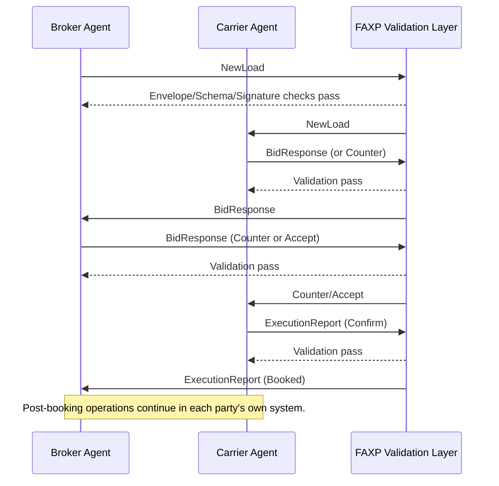

# Diagram: Booking Message Flow

This diagram is explanatory, not normative.
Canonical message semantics remain in:
- `faxp.schema.json`
- `docs/governance/SCOPE_GUARDRAILS.md`

```mermaid
sequenceDiagram
    participant Broker as Broker Agent
    participant Carrier as Carrier Agent
    participant FAXP as FAXP Validation Layer

    Broker->>FAXP: NewLoad
    FAXP-->>Broker: Envelope/Schema/Signature checks pass
    FAXP->>Carrier: NewLoad

    Carrier->>FAXP: BidResponse (or Counter)
    FAXP-->>Carrier: Validation pass
    FAXP->>Broker: BidResponse

    Broker->>FAXP: BidResponse (Counter or Accept)
    FAXP-->>Broker: Validation pass
    FAXP->>Carrier: Counter/Accept

    Carrier->>FAXP: ExecutionReport (Confirm)
    FAXP-->>Carrier: Validation pass
    FAXP->>Broker: ExecutionReport (Booked)

    Note over Broker,Carrier: Post-booking operations continue in each party's own system.
```

